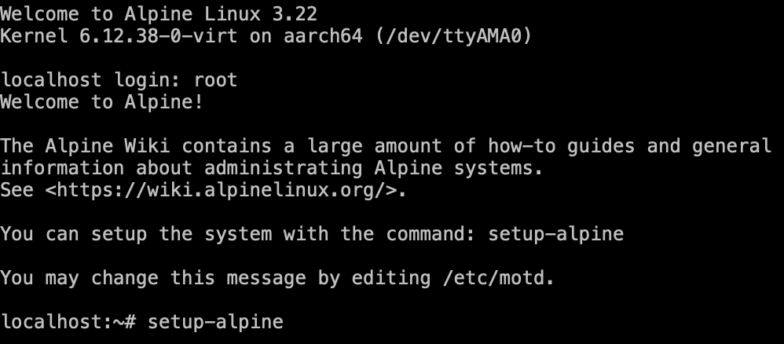
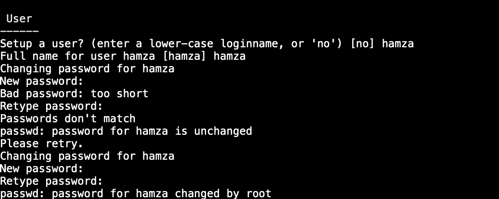
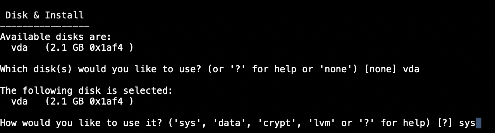
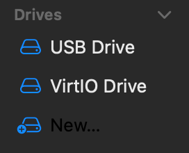
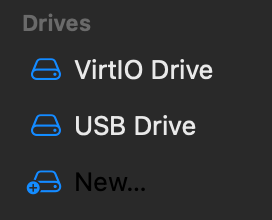
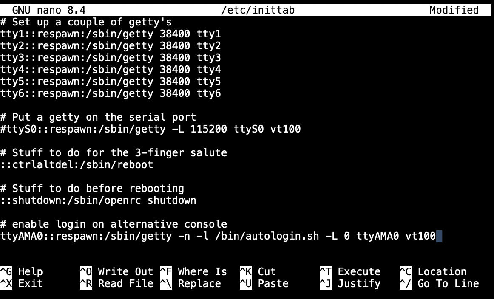
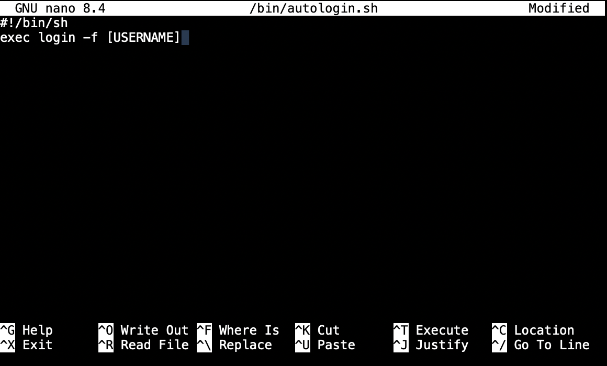
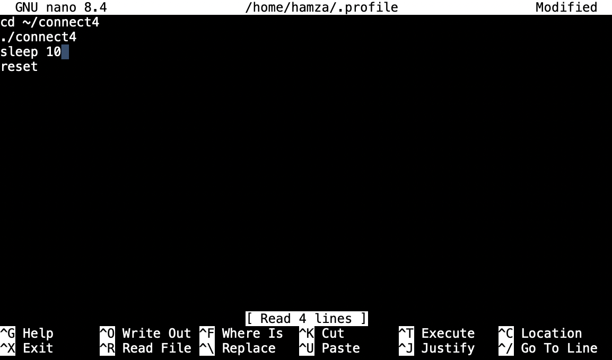

# Connect 4 Game

A classic Connect 4 game implementation in C, where two players take turns dropping pieces into a 6x7 grid to get four in a row.

## Project Structure

```
connect4/
├── include/
│   ├── board.h      # Board-related function declarations
│   └── game.h       # Game logic function declarations
├── src/
│   ├── main.c       # Entry point
│   ├── board.c      # Board setup and display functions
│   └── game.c       # Game logic and win detection
├── Makefile         # Build configuration
└── README.md        # This file
```

## Building and Running

### Prerequisites
- GCC compiler
- Make utility

### Build Instructions

1. **Compile the project:**
   ```bash
   make
   ```

2. **Run the game:**
   ```bash
   ./connect4
   ```

3. **Clean build artifacts:**
   ```bash
   make clean
   ```

# Steps to setup Alpine linux VM

## 1) Make the VM:
Install the iso, create a VM and boot it with the iso

## 2) Setup Alpine Linux:
Start the VM and use root as localhost login.  
Then start the setup with
```
setup-alpine
```


## 3) Create a user:
In the setup, create a user.



## 4) Install Alpine on a disk:
In the setup, choose the main drive as the drive to install alpine on.



## 5) Edit the VM Settings:
After shutting down, remove the ISO, so that the vm boots the drive where you installed alpine

Go from this   
   
to this   


You may delete the USB drive. AFter that boot and go through the steps below.

# Steps to run on startup on Alpine Linux VM

## 1) Installation and setup:

To install all required packages run:

```
apk update
apk add git nano build-base 
```

## 2) Building:

To build everything run:

```
git clone https://github.com/Hamza-69/connect4
cd connect4
make
```

## 3) Running on startup

Edit the /etc/inittab file with:

```
su
nano /etc/inittab
```

Change the last line into:



Create the autologin shell script:
This and the previous step makes it so immideatly on startup, the shell is redirected to the user required to login to.

```
su
nano /bin/autologin.sh
```



## 4) Make a profile file for auto start

```
exit #to exit from su. Omit if you aren't on super user.
nano ~/.profile
```



### After all the steps reboot and it should be working right!
