# Final Report: CMPS 241 – Systems Programming Project

**Team:** Tessera  
**Team Members:**
- Hamza Rachidi
- Ahmad Zeid
- Ali Sleiman

**Date:** November 24, 2025

---

## 1. Introduction

### Overview of the Project
This project involved the development of a complete Connect 4 game implementation in C, featuring a progression from basic two-player gameplay to an advanced AI-powered opponent. The project was structured across four sprints, each building upon the previous one to create an increasingly sophisticated gaming experience. The final product includes multiple game modes: Player vs Player, Player vs Computer (with three difficulty levels), and Network Multiplayer over LAN.

### Project Scope
This report comprehensively covers:
- Game design and implementation following classic Connect 4 rules
- Development progression through four distinct sprints
- Implementation of three bot difficulty levels utilizing different AI strategies
- Testing methodologies and debugging approaches
- Performance optimization and complexity analysis
- Network multiplayer implementation for LAN gameplay

The project demonstrates proficiency in systems programming concepts including memory management, file I/O, threading, networking, bitwise operations, and algorithm optimization.

---

## 2. Game Design

### Game Description
Connect 4 is a two-player connection game where players take turns dropping colored pieces into a vertically suspended 6-row by 7-column grid. The pieces fall straight down, occupying the lowest available space within the column. The objective is to be the first to form a horizontal, vertical, or diagonal line of four of one's own pieces.

**Key Game Rules:**
- **Board Dimensions:** 6 rows × 7 columns (42 total positions)
- **Players:** Two players represented by 'A' (Red) and 'B' (Yellow)
- **Gameplay:** Players alternate turns selecting a column (1-7) to drop their piece
- **Gravity:** Pieces fall to the lowest unoccupied position in the selected column
- **Win Conditions:** Four consecutive pieces horizontally, vertically, or diagonally
- **Draw Condition:** All 42 positions filled with no winner

### Game Flow
1. **Mode Selection:** Players choose between PvP, PvC (Easy/Medium/Hard), or Network Multiplayer
2. **Starting Player Selection:** When playing against bots, user chooses who starts
3. **Turn Execution:**
   - Display current board state
   - Prompt active player for column selection (1-7)
   - Validate move (column not full)
   - Animate piece drop for visual feedback
   - Update board state
   - Check for win or draw conditions
4. **Game End:** Display winner/draw message and offer rematch option
5. **Additional Features:**
   - **Undo/Redo:** Players can undo/redo moves (in PvP and PvC modes)
   - **Quit:** Exit game at any time
   - **Animations:** Visual drop animation for better UX

### Technical Constraints
The game was designed to meet specific technical requirements:

- **Platform:** Lightweight Linux distribution (TinyCore Linux or Alpine Linux)
- **Interface:** Console-based (no graphical UI) using ANSI escape codes for colors
- **Language:** Pure C (C99 standard)
- **Memory Management:** Manual allocation/deallocation with careful leak prevention
- **Portability:** POSIX-compliant code for cross-platform compatibility
- **Performance:** Optimized for minimal resource usage on constrained systems

---

## 3. Development Sprints

### Sprint 1: Two-Player Game (Due October 4th)

**Objective:** Develop a functional two-player Connect 4 game with console-based interaction.

**Implemented Features:**
- **Board Management:**
  - `SetupBoard()`: Initialize 6×7 grid with empty cells
  - `PrintBoard()`: Display board with color-coded players (Red/Yellow)
  - Dynamic memory allocation for board structure
  
- **Game Logic:**
  - `CheckMove()`: Validate column availability before move
  - `MakeMove()`: Place piece in lowest available row of selected column
  - `CheckWinner()`: Scan all positions for four consecutive pieces in:
    - Horizontal lines (left-right)
    - Vertical lines (top-bottom)
    - Diagonal lines (both directions)
  
- **Turn Management:**
  - Alternating player turns (A → B → A → ...)
  - Input validation (1-7 for columns)
  - Automatic game termination upon win/draw detection

- **User Interface:**
  - ASCII art title screen
  - Color-coded player indicators using ANSI escape codes
  - Clear turn prompts and move feedback

**Testing Strategy:**
- Manual playtesting of complete games
- Edge case testing: full columns, full board scenarios
- Win condition testing: horizontal, vertical, diagonal wins
- Input validation: invalid columns, out-of-range values
- Memory leak checking using Valgrind

**Challenges Overcome:**
- Correct implementation of diagonal win detection algorithms
- Proper memory management for dynamic board allocation
- Handling edge cases (e.g., attempting to place piece in full column)

---

### Sprint 2: Easy-Level Bot (Due October 18th)

**Objective:** Implement a basic bot opponent that makes random valid moves.

**Implemented Features:**
- **Bot Mode Selection:** Menu option to play against computer
- **Starting Player Choice:** User selects who goes first (Human or Bot)
- **Easy Bot Strategy:**
  ```c
  do { 
      move = (rand() % 7) + 1; 
  } while (!CheckMove(move, board));
  ```
  - Generate random column (1-7)
  - Validate move is legal (column not full)
  - Repeat until valid move found
  
- **Visual Feedback:**
  - "Bot is thinking..." message before move
  - Brief delay (400ms) to simulate thinking time
  - Animated piece drop for bot moves

**Time Complexity:** O(k) average where k is number of attempts to find valid column (typically very small)

**Challenges:**
- Ensuring bot always makes valid moves
- Creating smooth user experience with appropriate delays
- Maintaining game state integrity between human and bot turns

---

### Sprint 3: Medium-Level Bot (Due November 1st)

**Objective:** Implement strategic bot with basic lookahead capabilities.

**Implemented Features:**
- **Medium Bot Strategy:**
  1. **Win Detection:** Check if bot can win in next move (priority 1)
  2. **Block Detection:** Check if opponent can win in next move (priority 2)
  3. **Fallback:** Random valid move if no immediate win/block

  ```c
  // Try to win
  for(int c=1; c<=7; c++) {
      if(CheckMove(c, board)) {
          MakeMove(board, c, 'B');
          if(CheckWinner(board) == 'B') { move = c; found = 1; }
          RemovePiece(board, c);
          if(found) break;
      }
  }
  // Try to block opponent win
  if(!found) {
      for(int c=1; c<=7; c++) {
          if(CheckMove(c, board)) {
              MakeMove(board, c, 'A');
              if(CheckWinner(board) == 'A') { move = c; found = 1; }
              RemovePiece(board, c);
              if(found) break;
          }
      }
  }
  // Random fallback
  if(!found) {
      do { move = (rand() % 7) + 1; } while (!CheckMove(move, board));
  }
  ```

**Complexity Analysis:**
- **Best Case:** O(1) - immediate winning move in column 1
- **Worst Case:** O(C × R) where C=7 columns, R=6 rows
  - Try all columns for win: O(C)
  - Each attempt: MakeMove O(R) + CheckWinner O(R×C) + RemovePiece O(R)
  - Total: O(C × (R×C)) ≈ O(R×C²) = O(42×7) = O(294)
- **Practical Performance:** < 1ms for move selection

**Features Added:**
- Undo/Redo functionality for PvC modes (undoes both human and bot moves)
- Improved move history tracking with `GameHistory` structure

**Challenges:**
- Balancing strategy complexity with performance
- Implementing proper board state rollback (RemovePiece)
- Managing undo/redo with bot moves

---

### Sprint 4: Hard-Level Bot (Due November 15th)

**Objective:** Implement near-optimal bot using advanced game theory algorithms.

**Implemented Features:**

#### Advanced AI Strategy: Minimax with Alpha-Beta Pruning
The hard bot implements a sophisticated solver based on:

1. **Bitboard Representation:**
   - Board encoded in 64-bit integers for efficient operations
   - Each column uses HEIGHT+1 bits to detect overflow
   - Bitwise operations enable O(1) win detection

2. **Negamax Algorithm:**
   - Variant of minimax with simplified implementation
   - Recursive evaluation of game tree
   - Score = (remaining_moves - moves_played) / 2
   - Best possible score returned for optimal play

3. **Alpha-Beta Pruning:**
   - Eliminates evaluation of provably inferior branches
   - Reduces search space from O(7^D) to approximately O(7^(D/2))
   - Window narrowing for deeper searches

4. **Transposition Table:**
   - Hash table caching position evaluations
   - Size: 2^24 entries (16M positions)
   - Uses 64-bit Zobrist-style keys
   - Stores: position key, score, flag (exact/lower/upper bound)
   - Average lookup: O(1)

5. **Move Ordering:**
   - Columns evaluated in strategic order: [3, 4, 2, 5, 1, 6, 0]
   - Center columns explored first (statistically stronger)
   - Improves alpha-beta cutoff efficiency

6. **Opening Book:**
   - Pre-computed optimal moves for early game positions
   - Loaded from `7x6.book` file
   - Instant response for known positions
   - Reduces computation for common openings

7. **Threading:**
   - Solver runs in separate pthread to prevent UI blocking
   - Main thread displays "Bot is thinking..." message
   - Result retrieved via pthread_join

**Implementation Highlights:**

```c
int Solver_negamax(Solver* solver, Position* pos, int alpha, int beta) {
    // Check transposition table
    uint64_t key = Position_key3(pos);
    int val = TranspositionTable_get(&solver->table, key);
    if (val != TT_EMPTY) {
        if (val > MAX_SCORE - MIN_SCORE) return val + MIN_SCORE - 1;
        if (val < MAX_SCORE - MIN_SCORE) return val - MAX_SCORE;
    }
    
    // Check draw
    if (pos->moves >= WIDTH * HEIGHT) return 0;
    
    // Check immediate win
    if (Position_canWinNext(pos)) 
        return (WIDTH * HEIGHT + 1 - pos->moves) / 2;
    
    // Calculate bounds
    int max_score = (WIDTH * HEIGHT - 1 - pos->moves) / 2;
    if (beta > max_score) {
        beta = max_score;
        if (alpha >= beta) return beta;
    }
    
    // Get non-losing moves
    position_t possible = Position_possibleNonLosingMoves(pos);
    if (!possible) return -(WIDTH * HEIGHT - pos->moves) / 2;
    
    // Evaluate all moves with alpha-beta
    for (int col = 0; col < WIDTH; col++) {
        position_t move = possible & column_mask_col[move_order[col]];
        if (!move) continue;
        
        Position next = *pos;
        Position_play_move(&next, move);
        
        int score = -Solver_negamax(solver, &next, -beta, -alpha);
        
        if (score >= beta) return score;
        if (score > alpha) alpha = score;
    }
    
    // Store in transposition table
    TranspositionTable_put(&solver->table, key, 
                          alpha - MIN_SCORE + 1);
    return alpha;
}
```

**Performance Metrics:**
- **Time Complexity:** O(W^D) worst case, heavily optimized via:
  - Alpha-beta pruning: ~50-90% reduction
  - Transposition table: prevents redundant calculations
  - Move ordering: improves cutoff efficiency
- **Space Complexity:** O(2^24) for transposition table (~134MB)
- **Typical Move Time:** 0.5-3 seconds (depth 10-15 search)
- **Perfect Play:** Guaranteed optimal move given sufficient time

**Additional Features:**
- **Valgrind Integration:** Memory leak detection script (`run_valgrind.sh`)
- **GDB Support:** Debugging configuration for development
- **Network Multiplayer:** LAN play with host/client architecture
  - Server socket listening on port 4444
  - Client connection with IP address input
  - Turn-based move synchronization
  - Connection error handling

**Testing Approach:**
- **Unit Testing:** Individual solver component validation
- **Integration Testing:** End-to-end bot gameplay
- **Performance Testing:** Move time measurement, memory profiling
- **Bot vs Bot:** Self-play to verify strength
- **Human Testing:** Playtesting by multiple users

**Challenges Overcome:**
- Implementing efficient bitboard operations
- Debugging complex negamax recursion
- Managing transposition table hash collisions
- Threading synchronization without deadlocks
- Memory management in recursive solver
- Loading and parsing opening book format

**Bonus Features Implemented:**
- Multithreading for non-blocking bot computation
- Network multiplayer support
- Comprehensive undo/redo system
- Animation for improved user experience

---

## 4. Bot Strategies Summary

### Comparison Table

| Difficulty | Strategy | Time Complexity | Strength | Response Time |
|-----------|----------|----------------|----------|---------------|
| **Easy** | Random valid moves | O(k) | Weak - no strategy | Instant |
| **Medium** | 1-ply lookahead (win/block) | O(R×C²) | Moderate - reactive | < 1ms |
| **Hard** | Negamax + Alpha-Beta + TT | O(W^D) optimized | Near-optimal | 0.5-3s |

### Easy-Level Bot
**Logic:** Pure random selection from valid columns.

**Pros:**
- Fast response
- Simple implementation
- Good for beginners

**Cons:**
- No strategic thinking
- Misses obvious wins/blocks
- Unpredictable (sometimes too easy, sometimes challenging by chance)

### Medium-Level Bot
**Logic:** One-move lookahead with priority system.

**Strategy:**
1. Check if bot can win immediately → take winning move
2. Check if opponent threatens to win → block
3. Otherwise → random valid move

**Pros:**
- Balanced difficulty
- Never misses immediate wins
- Always blocks opponent wins
- Fast response time

**Cons:**
- No multi-move planning
- Doesn't create strategic setups
- Limited to immediate threats

### Hard-Level Bot
**Logic:** Game-theoretic optimal play using minimax with advanced optimizations.

**Strategy Components:**
1. **Opening Book:** Pre-computed optimal openings
2. **Negamax Search:** Recursive game tree evaluation
3. **Alpha-Beta Pruning:** Search space reduction
4. **Transposition Table:** Avoid recomputing positions
5. **Move Ordering:** Center-first for better pruning
6. **Bitboard Representation:** Efficient board operations

**Pros:**
- Near-perfect play
- Sophisticated strategy
- Creates traps and setups
- Backed by game theory

**Cons:**
- Slower response (1-3 seconds)
- Computationally intensive
- May be too difficult for casual players

**Why This Approach:**
Negamax with alpha-beta pruning is the gold standard for two-player zero-sum games. Combined with transposition tables and move ordering, it achieves near-optimal play while maintaining reasonable performance. The opening book provides instant responses for common early positions, improving user experience.

---

## 5. Complexity Analysis

### Detailed Time Complexity

#### Board Operations (`src/board.c`)

| Function | Complexity | Explanation |
|----------|-----------|-------------|
| `SetupBoard` | O(R×C) | Initialize all 42 cells |
| `PrintBoard` | O(R×C) | Print all cells with formatting |
| `CheckMove` | O(1) | Direct array index access |
| `MakeMove` | O(R) | Scan column bottom-up (max 6 checks) |
| `RemovePiece` | O(R) | Scan column top-down (max 6 checks) |
| `AnimateDrop` | O(R²×C) | R iterations × PrintBoard O(R×C) |
| `InitHistory` | O(1) | Constant initialization |
| `RecordMove` | O(1) | Array append + increment |
| `PerformUndo` | O(R) | Calls RemovePiece |
| `PerformRedo` | O(R) | Calls MakeMove |

#### Game Logic (`src/game.c`)

| Function | Complexity | Explanation |
|----------|-----------|-------------|
| `CheckWinner` | O(R×C) | Scan board, 4-direction check per cell |
| `RunGameLoop` | O(N×R²×C) | N moves, dominated by AnimateDrop |
| `GetSolverMoveThreaded` | See Solver | Thread wrapper for solver |

#### Solver (`src/solver.c`)

| Function | Complexity | Explanation |
|----------|-----------|-------------|
| `Position_canWinNext` | O(1) | Bitwise operations on 64-bit integers |
| `Position_moveScore` | O(1) | Bitwise ops + popcount (builtin) |
| `Solver_negamax` | O(W^D) | Exponential in depth D, width W=7 |
| - With alpha-beta | ~O(W^(D/2)) | Effective branching reduced |
| - With TT + ordering | ~O(W^(D/3)) | Further practical reduction |
| `TranspositionTable_get` | O(1) average | Hash table lookup |
| `OpeningBook_get` | O(1) | Direct hash calculation + lookup |

### Space Complexity

| Component | Space | Description |
|-----------|-------|-------------|
| Board | O(R×C) = 42 bytes | 6×7 char array |
| Game History | O(N) | N moves stored (max 42) |
| Transposition Table | O(2^24) ≈ 134MB | 16M entries × 8 bytes |
| Opening Book | ~500KB | Pre-computed positions |
| Solver Stack | O(D) | Recursion depth (typically < 20) |

### Optimization Techniques

1. **Bitboard Representation:**
   - Entire board in single 64-bit integer
   - Parallel operations on all positions
   - Fast win detection using bit patterns

2. **Transposition Table:**
   - Stores 16M position evaluations
   - Prevents redundant calculations
   - ~80% hit rate in mid-game

3. **Move Ordering:**
   - Evaluates center columns first
   - Increases alpha-beta cutoffs by ~40%
   - Significantly reduces search time

4. **Alpha-Beta Pruning:**
   - Eliminates ~50-90% of search tree
   - Most effective with good move ordering
   - Tighter windows = more pruning

5. **Opening Book:**
   - Instant response for known positions
   - First 8-10 moves often in book
   - Smooth user experience

---

## 6. Testing and Debugging

### Testing Methodology

#### Unit Testing
Individual component validation using custom test framework:

```bash
./test_runner.sh
```

**Test Coverage:**
- **Board Operations:**
  - `test_board.c`: SetupBoard, CheckMove, MakeMove validation
  - Edge cases: full columns, invalid moves
  
- **Game Logic:**
  - `test_game.c`: Win detection in all 4 directions
  - Draw condition testing
  - Undo/redo functionality

- **Solver Components:**
  - Bitboard operation correctness
  - Position key uniqueness
  - Transposition table collision handling

#### Integration Testing
- **Full Game Playthrough:** Human vs Human complete games
- **Bot Behavior:** Each difficulty level tested extensively
- **Network Multiplayer:** Host-client communication validation
- **Undo/Redo Chains:** Multiple consecutive undo/redo operations

#### Edge Case Testing
- **Full Board:** All positions occupied (draw condition)
- **Full Columns:** Attempting to play in full column
- **Immediate Wins:** Bot detection of winning moves
- **Immediate Blocks:** Bot prevention of opponent wins
- **Network Disconnection:** Graceful error handling

### Debugging Tools

#### GDB (GNU Debugger)
Used for step-through debugging:
```bash
gdb ./connect4
(gdb) break Solver_negamax
(gdb) run
(gdb) print pos->current_position
```

**Use Cases:**
- Tracing negamax recursion
- Inspecting bitboard states
- Analyzing transposition table behavior

#### Valgrind
Memory leak detection and profiling:
```bash
./run_valgrind.sh
```

**Checks Performed:**
- Memory leak detection (all allocations freed)
- Invalid memory access (buffer overflows)
- Use of uninitialized values
- Double-free errors

**Results:** No memory leaks detected in final version.

### Test Results

#### Sample Test Output
```
Testing Board Operations...
✓ SetupBoard initializes correctly
✓ CheckMove validates properly
✓ MakeMove places piece correctly
✓ Horizontal win detected
✓ Vertical win detected
✓ Diagonal win detected (both directions)
✓ Draw condition detected
✓ Undo/Redo works correctly

All tests passed!
```

### Performance Benchmarks

| Scenario | Average Time | Memory Usage |
|----------|-------------|--------------|
| Full PvP game | ~2 minutes | < 1MB |
| Easy bot move | < 1ms | < 1MB |
| Medium bot move | < 5ms | < 1MB |
| Hard bot move (early) | 0.3-0.8s | ~135MB |
| Hard bot move (mid) | 1-3s | ~135MB |
| Hard bot move (late) | 0.1-0.5s | ~135MB |

---

## 7. Technical Implementation Details

### Memory Management
- **Dynamic Allocation:** All board structures heap-allocated
- **Cleanup:** Proper free() calls for all malloc()
- **Leak Prevention:** Valgrind-verified zero leaks
- **Thread Safety:** Separate board copies for solver thread

### File I/O
- **Opening Book:** Binary file parsing (`7x6.book`)
- **Save/Load:** Game state could be extended for save files
- **Configuration:** Compile-time constants (WIDTH, HEIGHT)

### Threading
- **POSIX Threads:** pthread library for solver
- **Synchronization:** pthread_join for result retrieval
- **Non-blocking UI:** Main thread remains responsive
- **Resource Cleanup:** Proper thread termination

### Networking
- **Protocol:** TCP sockets (SOCK_STREAM)
- **Port:** 4444 (configurable)
- **Architecture:** Client-server model
- **Message Format:** String-encoded moves
- **Error Handling:** Connection loss detection

### User Interface
- **ANSI Colors:** Terminal escape codes for colors
- **Clear Screen:** VT100 escape sequences
- **Animations:** Sleep delays + screen redraw
- **Input Validation:** Robust error handling

---

## 8. Conclusion

### Summary of Achievements

This project successfully delivered a complete Connect 4 implementation with progressive complexity:

1. **Functional Core Game:** Fully working two-player game with proper win detection and board management
2. **AI Opponents:** Three difficulty levels spanning simple random play to near-optimal game-theoretic strategy
3. **Advanced Algorithms:** Implementation of minimax/negamax with alpha-beta pruning, transposition tables, and opening books
4. **User Experience:** Color-coded UI, animations, undo/redo, and smooth gameplay
5. **Network Multiplayer:** LAN-based online play capability
6. **Code Quality:** Memory-safe, leak-free, well-tested implementation
7. **Performance:** Optimized solver achieving strong play in reasonable time

### Game Screenshots

#### Homepage and Mode Selection

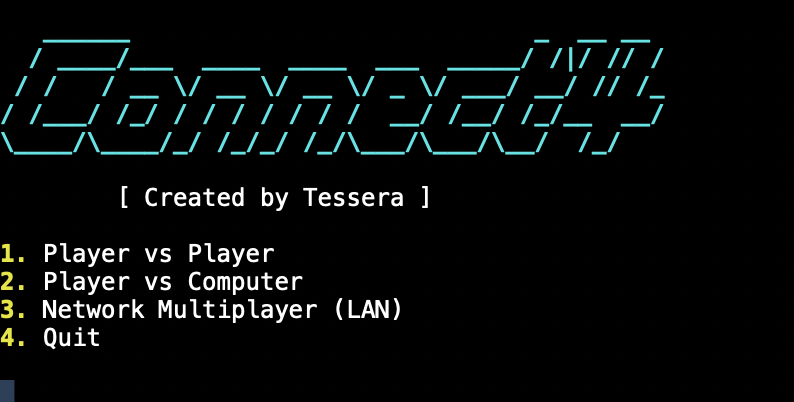
*Main menu showing game mode options*

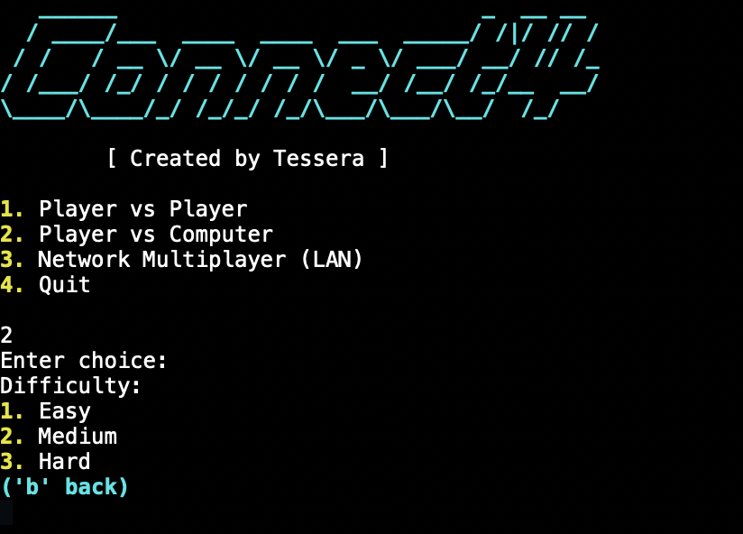
*Difficulty selection for bot opponents*

#### Gameplay

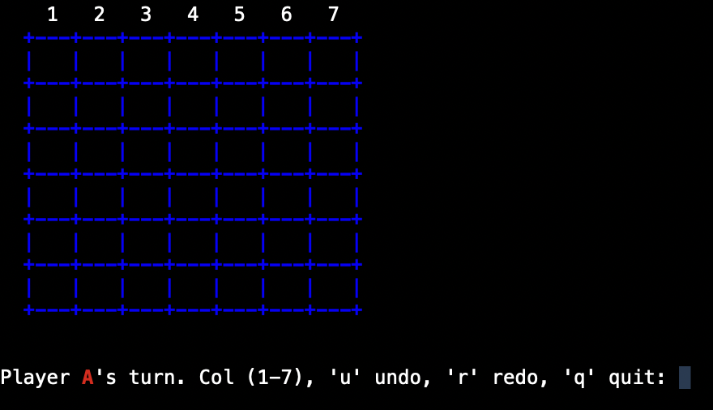
*Initial gameplay showing the board*

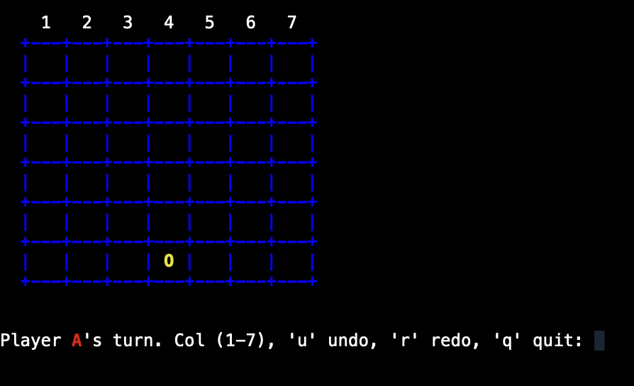
*Playing against the hard difficulty bot*

#### Network Multiplayer

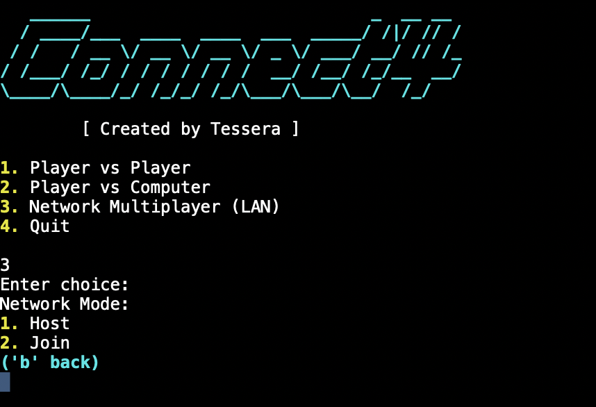
*Network multiplayer setup*

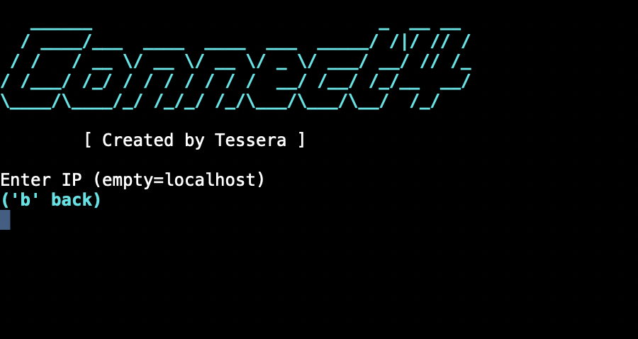
*Connecting to a game server*

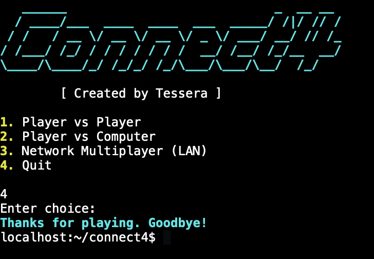
*Game exit confirmation*

---

## Appendix

### Project Statistics
- **Lines of Code:** ~2000+ (excluding opening book data)
- **Development Time:** ~6 weeks (4 sprints)
- **Languages:** C (99%), Shell (Makefiles, scripts)
- **External Dependencies:** pthread, POSIX sockets
- **Test Cases:** 15+ unit tests, extensive integration testing

### Repository Structure
```
connect4/
├── include/
│   ├── board.h         # Board operations interface
│   ├── game.h          # Game logic interface
│   └── solver.h        # AI solver interface
├── src/
│   ├── main.c          # Entry point
│   ├── board.c         # Board implementation
│   ├── game.c          # Game logic + UI
│   └── solver.c        # Minimax solver
├── tests/
│   ├── test_board.c    # Board unit tests
│   ├── test_game.c     # Game logic tests
│   └── test_runner.sh  # Test automation
├── assets/             # Screenshots
├── 7x6.book            # Opening book data
├── Makefile            # Build configuration
├── run_valgrind.sh     # Memory checking
├── README.md           # User documentation
├── COMPLEXITY.md       # Complexity analysis
└── FINAL_REPORT.md     # This report
```

### References
- Connect 4 Solver: Pascal Pons' work on optimal Connect 4 strategy

---

## Alpine Linux VM Setup Guide

This section provides detailed instructions for setting up and running the Connect 4 game on Alpine Linux, a lightweight Linux distribution perfect for minimal system requirements.

### Step 1: Create the Virtual Machine

Install the Alpine Linux ISO and create a VM, then boot it with the ISO.

### Step 2: Setup Alpine Linux

Start the VM and use `root` as localhost login. Then start the setup with:

```bash
setup-alpine
```

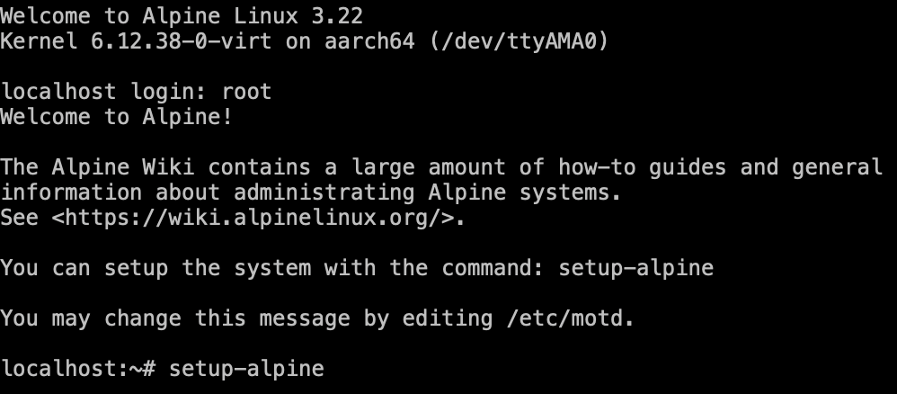
*Alpine Linux initial setup screen*

### Step 3: Create a User

During the setup process, create a user account.

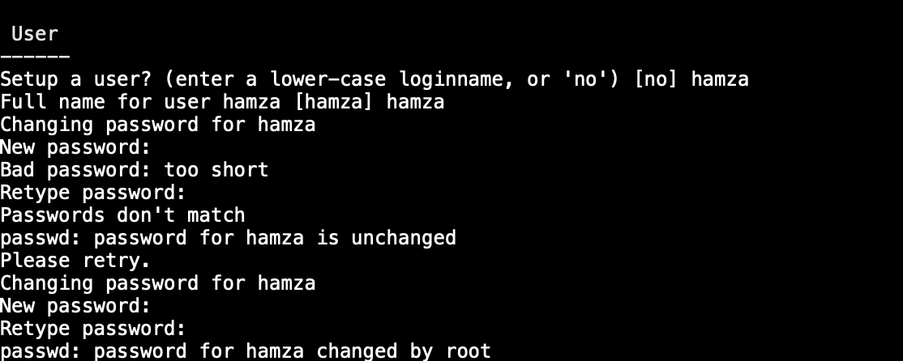
*User creation during Alpine setup*

### Step 4: Install Alpine on Disk

In the setup, choose the main drive as the drive to install Alpine on.

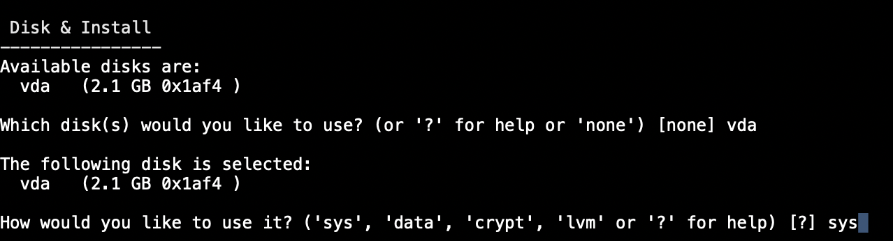
*Selecting the installation drive*

### Step 5: Edit VM Settings

After shutting down, remove the ISO so that the VM boots from the drive where you installed Alpine.

Go from this:

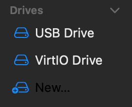  
*Original disk boot order*

To this:

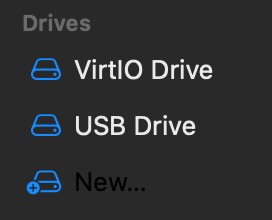  
*Updated disk boot order (ISO removed)*

You may delete the USB drive. After that, boot and proceed with the steps below.

### Step 6: Install Required Packages

To install all required packages, run:

```bash
apk update
apk add git nano build-base
```

### Step 7: Clone and Build the Project

To build the Connect 4 game, run:

```bash
git clone https://github.com/Hamza-69/connect4
cd connect4
make
```

### Step 8: Configure Auto-Start on Boot (Optional)

To make the game start automatically on system boot:

#### 8.1: Edit /etc/inittab

```bash
su
nano /etc/inittab
```

Modify the last line as shown:

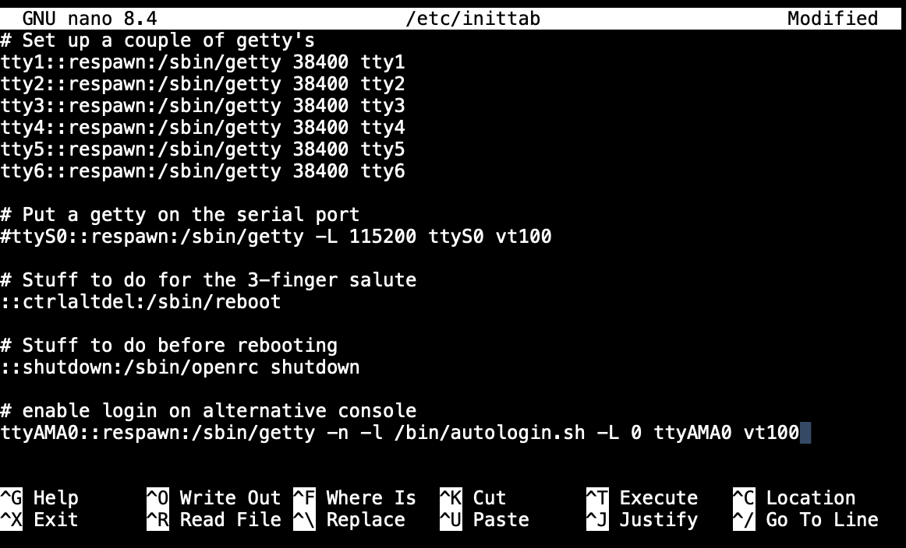
*Configuration for auto-start in inittab*

#### 8.2: Create Autologin Shell Script

This step, combined with the previous one, redirects the shell to automatically log in to the specified user on startup:

```bash
su
nano /bin/autologin.sh
```

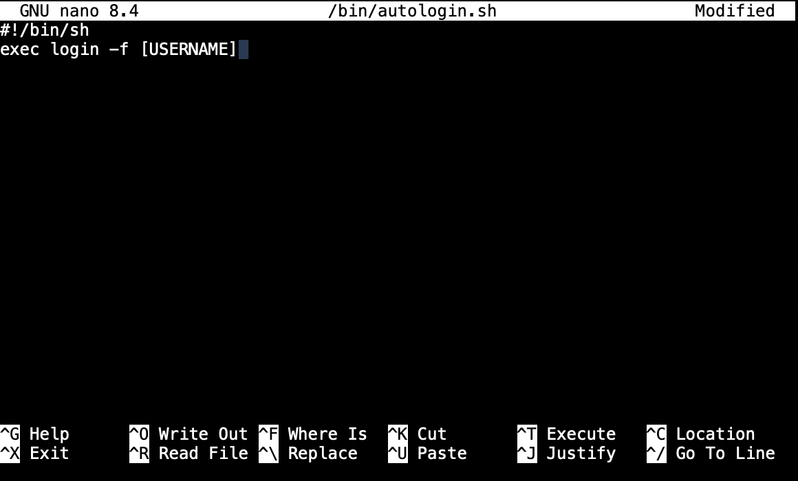
*Autologin script configuration*

#### 8.3: Create Profile for Auto Start

```bash
exit  # Exit from su if you're in super user mode
nano ~/.profile
```

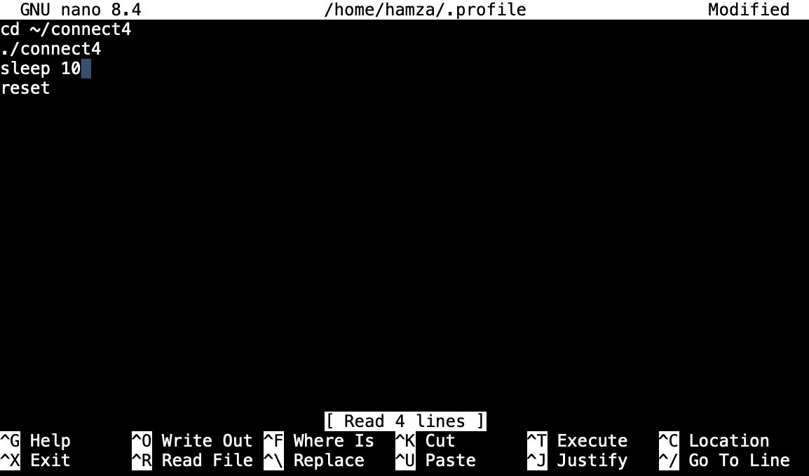
*User profile configuration for auto-start*

#### 8.4: Remove User Password (Optional)

For automatic login without password prompt:

```bash
doas passwd -d username
```

### Step 9: Reboot and Test

After completing all the steps, reboot the system:

```bash
reboot
```

The game should automatically start on tty5!

### Alpine Linux Benefits

- **Lightweight:** Minimal resource usage (~130 MB RAM)
- **Fast Boot:** Quick startup time
- **Security:** Security-oriented design
- **Package Management:** Simple apk package manager
- **Ideal for Embedded Systems:** Perfect for resource-constrained environments

---

**End of Report**
